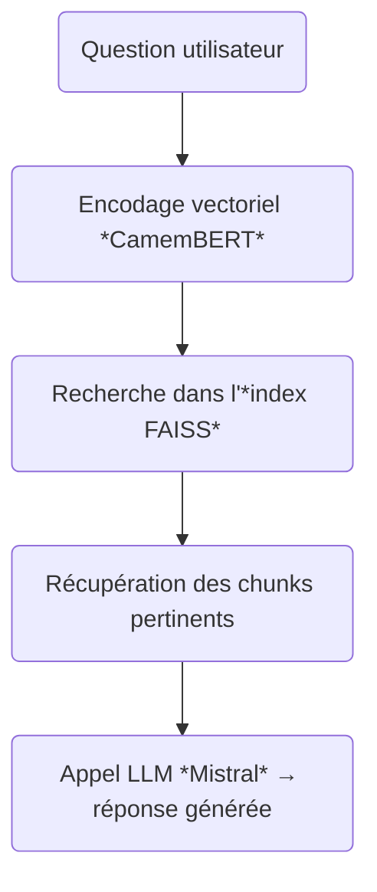
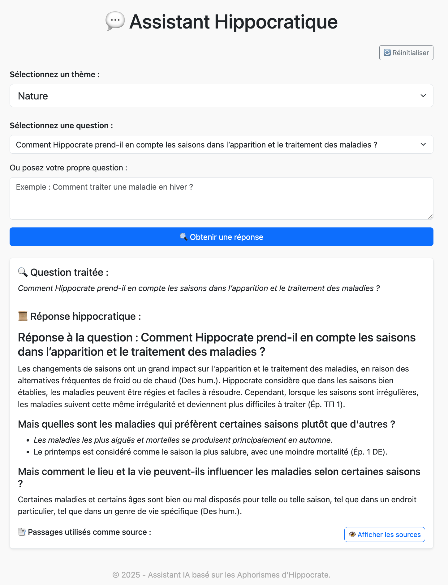

# 🏛️ Assistant Hippocratique : RAG basé sur les Aphorismes d'Hippocrate  
> “Je jure par Apollon médecin, par Asclépios, Hygie et Panacée…”  
> — Serment d’Hippocrate

[](LICENSE)

🧠 Explorez les fondements de la médecine occidentale grâce à un système **RAG (Retrieval-Augmented Generation)** moderne, alimenté par les *Aphorismes d’Hippocrate*.

---

## 🎯 Objectifs du Projet

- ✨ Explorer un corpus historique de textes médicaux anciens.
- 🧠 Utiliser le **RAG** pour faciliter l’apprentissage interactif des textes classiques.
- 📚 Mettre en avant les principes hippocratiques via une interface numérique moderne.
- 🧑‍⚕️ Inspirer une approche pédagogique de la redécouverte des textes médicaux anciens.

---

## ⚖️ Enjeux Pédagogiques et Éducatifs

### 🧑‍🏫 Vulgarisation des textes fondateurs
- Permet aux utilisateurs d’explorer les bases de la médecine antique.
- Encourage une réflexion critique à travers l’analyse des textes originaux.
- Facilite la compréhension de l’évolution de la pensée médicale.

### 📚 Apprentissage Interactif
- Méthode active : poser des questions et recevoir des réponses contextualisées.
- Développe la compétence "recherche + synthèse" via un assistant IA.
- Favorise l’autonomie dans l’étude des textes classiques.

### 🧠 Référentiel Sémantique Médical Ancien
- Exploration du langage médical ancien via NLP.
- Première étape vers la création de référentiels sémantiques historiques.
- Ouvre la voie à l'analyse d'autres œuvres majeures (Galien, Avicenne, etc.).

### 💡 Exemple Concret d’un RAG Appliqué à un Corpus de Médécine Ancienne
- Démonstration pratique de la chaîne complète RAG, du PDF au serveur web.
- Documentation pédagogique claire et reproductible.

---

## 🗂 Structure du Projet

```
.
├── data/
│   ├── hippocrates_questions.json  # Questions prédéfinies
│   └── hippocrate_rag_data.json    # Données préparées pour le RAG
├── models/
│   └── config_schema.py            # Schéma Pydantic de configuration
├── prepare_corpus/
│   └── process_pdf.ipynb           # Notebook d'extraction du PDF
├── rag/
│   └── hippocrag.py                # Moteur RAG principal
├── templates/
│   └── index.html                  # Template Jinja2 de l’interface
├── app.py                          # Point d’entrée Flask
├── config_loader.py                # Chargement du YAML
├── Dockerfile                      # Définition du conteneur
├── docker-compose.yml              # Orchestration
├── rag_config.yaml                 # Fichier de configuration global
├── requirements.txt                # Dépendances python pour exécuter le projet dans un conteneur docker
└── requirements_pjt.txt            # Dépendances Python pour executer le projet en local
```

---

## 🤖 Fonctionnement Technique

### 🧠 Base de Connaissances
Les *Aphorismes d’Hippocrate* proviennent de :
- **Titre** : *Aphorismes d'Hippocrate*, traduits par Émile Littré  
- **Format numérique** : PDF issu de [archive.org](https://archive.org/details/aphorismesdhippo00hipp)  
- **Pages traitées** : 96 à 260 (traduction française principale)

Ils sont découpés et stockés dans :
- `data/hippocrate_rag_data.json`  
- Et indexés avec **FAISS** après encodage sémantique via **Sentence-BERT** (`sentence-camembert-large`).

### 🔍 Recherche Vectorielle
À chaque question posée :
1. La requête est encodée en vecteur.
2. Une recherche par plus proches voisins est effectuée dans l’index FAISS.
3. Les passages pertinents sont récupérés.

### 🧾 Génération de Réponse
La réponse est générée par un **modèle LLM open-source (Mistral)** via **Ollama**, reformulée en français à partir des extraits trouvés.

### 📊 Diagramme du Workflow RAG



---

### 🧾 Explication détaillée des étapes

1. **[Question utilisateur]**  
   - L'utilisateur pose une question en langage naturel.
   - Exemple : *"Quel est le rôle du régime dans la santé selon Hippocrate ?"*

2. **[Encodage vectoriel (CamemBERT)]**
   - La question est encodée en vecteur grâce à un modèle sémantique comme **CamemBERT** ou **Sentence CamemBERT large**.
   - Permet de comparer la requête aux embeddings précalculés des aphorismes.

3. **[Recherche dans index FAISS]**
   - Le moteur de recherche vectorielle (FAISS) compare le vecteur de la question avec les embeddings stockés dans l’index.
   - Retourne les `top_k` passages les plus proches (ex: 6 fragments).

4. **[Récupération des chunks pertinents]**
   - Les textes associés aux vecteurs trouvés sont récupérés depuis la base JSON.
   - Ces chunks contiennent les informations nécessaires pour répondre à la question.

5. **[Appel LLM (Mistral) → réponse générée]**
   - Un prompt est construit à partir de la question et des contextes trouvés.
   - Le LLM (`mistral`, via Ollama) génère une réponse structurée en français.
   - Réponse renvoyée à l’utilisateur sous forme HTML ou texte brut.

---

## 🧰 Technologies Utilisées

| Technologie       | Usage |
|------------------|-------|
| Flask             | Backend API Web |
| Bootstrap 5.3     | Interface responsive |
| Sentence-BERT     | Encodage sémantique |
| FAISS             | Indexation vectorielle |
| Mistral (Ollama)  | Génération de réponses |
| Docker            | Déploiement portable |
| Bleach            | Sécurisation HTML |

---

## 📦 Prérequis

### ✅ Logiciels requis
- **Python 3.9+**
- **Docker** *(optionnel mais recommandé)*
- **Ollama** *(ou autre LLM compatible via API)*
- **Git** *(facultatif)*

### 💻 Configuration Matérielle Recommandée
- **Processeur** : architecture moderne (x86 ou ARM comme M1/M2/M4)
- **RAM** : minimum 16 Go, idéalement 24 Go
- **Stockage** : espace disque suffisant (~5–10 Go)

✅ **Testé avec succès** sur un Mac M4 avec 24 Go de RAM, Python 3.11, Docker Desktop et Ollama.

---

## 🚀 Démarrage rapide

### 1. 🧬 Cloner le dépôt distant

Commencez par cloner le dépôt GitHub sur votre machine locale :

```bash
git clone https://github.com/micheldpd24/rag_aph_hippocrate.git
cd rag_aph_hippocrate
```

---

### 2. 🐳 Avec Docker Compose (Recommandé)

Assurer vous d'abord que dans le fichier configuration rag_config.yaml nous avons bien:
rag: llm: endpoint: "http://ollama:11434/api/generate"

Lancez l’application en une seule commande grâce à Docker Compose :

```bash
docker compose up --build
```

Télécharger et lancer le modèle llm mistral
```bash
ollama run mistral
```

L’application sera accessible à l’adresse : [http://localhost:5000](http://localhost:5000)

---

### 3. 💻 En mode développement local

#### a. Préparer l’environnement virtuel

```bash
python -m venv .venv
```

Sous macOS / Linux :
```bash
source .venv/bin/activate
```

Sous Windows (CMD) :
```bash
.venv\Scripts\activate
```

#### b. Installer les dépendances Python

```bash
pip install -r requirements.txt
```

#### c. Démarrer le serveur Ollama

Ouvrez un nouveau terminal et démarrez le service Ollama :

```bash
ollama serve
```

#### d. Télécharger le modèle LLM (ex. Mistral)

Toujours dans ce terminal :

```bash
ollama run mistral
```

#### e. Configuration du endpoint du llm du RAG:

Assurez vous d'abord que dans le fichier configuration rag_config.yaml vous avez bien:
rag / llm / endpoint: "http://localhost:11434/api/generate"

#### f. Lancer l’application Flask

Revenez au terminal principal et exécutez :

```bash
python app.py
```

Accédez ensuite à l’interface via : [http://localhost:5000](http://localhost:5000)


---

## 📊 Extraction & Préparation du Corpus

Le notebook `prepare_corpus/process_pdf.ipynb` extrait les aphorismes depuis le PDF et les prépare pour le RAG :

### 📄 Étapes Principales
1. **Téléchargement du PDF**
2. **Nettoyage du texte** (mots coupés, erreurs de numérotation)
3. **Extraction structurée** des aphorismes
4. **Segmentation adaptée au RAG** :
   - < 450 caractères → conservé tel quel
   - 450–800 → divisé en 2 parties
   - > 800 → divisé en 3 parties avec chevauchement

### ✅ Format Final pour le RAG
Chaque document inclut :
- Un identifiant unique (`s1.aph_01.p100`)
- Le texte segmenté
- Des métadonnées (section, page, source)

---

## 🛠️ Configuration du Système RAG

Fichier central : `rag_config.yaml`

### 🖥️ Application Flask
| Paramètre        | Valeur par défaut          |
|------------------|----------------------------|
| `name`           | `"HippocRAG"`              |
| `debug`          | `true`                     |
| `host`           | `"0.0.0.0"`                |
| `port`           | `5000`                     |
| `secret_key`     | `"change_this_secret"`     |
| `data_dir`       | `"data"`                   |
| `cache_dir`      | `"cache"`                  |
| `question_cache_file` | `"questions_cache.json"`|

### 🔍 Moteur RAG
| Paramètre             | Valeur par défaut                        |
|-----------------------|------------------------------------------|
| `model.name`          | `"dangvantuan/sentence-camembert-large"`|
| `normalize_embeddings`| `true`                                   |
| `index.json_path`     | `"data/hippocrate_rag_data.json"`        |
| `faiss_path`          | `"hippocrate.index"`                     |
| `build_on_startup`    | `true`                                   |
| `top_k`               | `6`                                      |

### 🤖 LLM (Modèle de Génération)
| Paramètre   | Valeur par défaut / Description                                                                 |
|-------------|--------------------------------------------------------------------------------------------------|
| `provider`  | `"ollama"`<br>→ Fournisseur du modèle LLM utilisé                                               |
| `endpoint`  | - Local : `"http://localhost:11434/api/generate"`<br>→ Si lancé manuellement sur la machine<br><br>- Container : `"http://ollama:11434/api/generate"`<br>→ Si lancé via Docker Compose |
| `model`     | `"mistral"`<br>→ Modèle LLM utilisé pour générer les réponses                                  |

### 🔐 Sécurité
Balises HTML autorisées : `<p>`, `<h4>`, `<ul>`, `<em>`, `<strong>`, `<blockquote>`  
Protection contre XSS via `bleach`.

---

## 🧠 Implémentation du Moteur RAG

Classe principale : `HippocRAG_FAISS`

### 🔧 Fonctionnalités
- Encodage sémantique via `SentenceTransformer`
- Indexation rapide avec `FAISS`
- Génération de réponses via LLM externe
- Configuration flexible via YAML

### 📁 Entrées attendues
- `data/hippocrate_rag_data.json` : données segmentées
- `hippocrate.index` : index FAISS précalculé

---

## 🌐 Interface Web

Application Flask interactive permettant :
- De choisir un thème médical
- De poser une question personnalisée
- D’obtenir une réponse contextuelle construite à partir des aphorismes

Routes principales :
| Route            | Méthode | Description |
|------------------|---------|-------------|
| `/`              | GET/POST| Page principale |
| `/api/questions` | GET     | Charger des questions par thème |
| `/reset-cache`   | POST    | Vider le cache des réponses |


Interface web :


---

## 📄 Licence

MIT License – Voir le fichier [LICENSE](LICENSE)

---

## 🧑‍💻 Auteur

*Michel Douglas P*  
Ingénieur ML. 